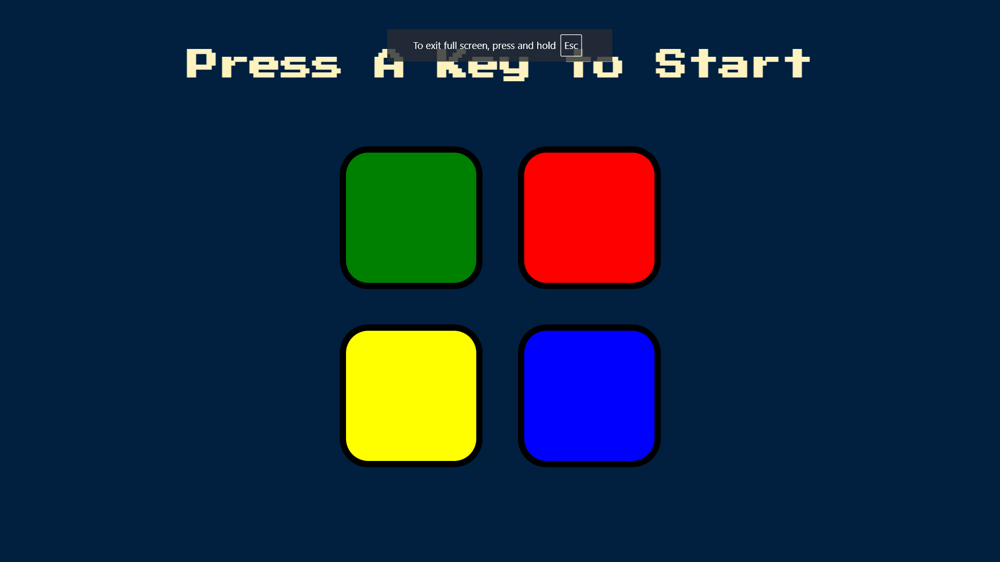

# 🎮 Simon Game  

## 📌 Overview  
Simon Game is a **memory-based color sequence game** built using **HTML, CSS, and JavaScript**. Players must **repeat an increasingly complex pattern** of colors generated by the game. If they get the sequence wrong, the game resets.  

## 🌐 Live Demo  
🔗 **Play Here:** [Click to Play](https://anilsol159.github.io/Simon-Game-html-css-js/)  

## 🖼 Screenshot  
  

## 🚀 Features  
- **Randomized Color Sequences** to test memory skills  
- **Interactive User Input** with clickable buttons  
- **Sound Effects** for each button press  
- **Progressive Difficulty** (sequence length increases after each round)  
- **Game Over Animation** when a mistake is made  

## 🛠 Installation  

1. Clone this repository:  
   ```bash
   git clone <repo-url>
   cd <repo-folder>
